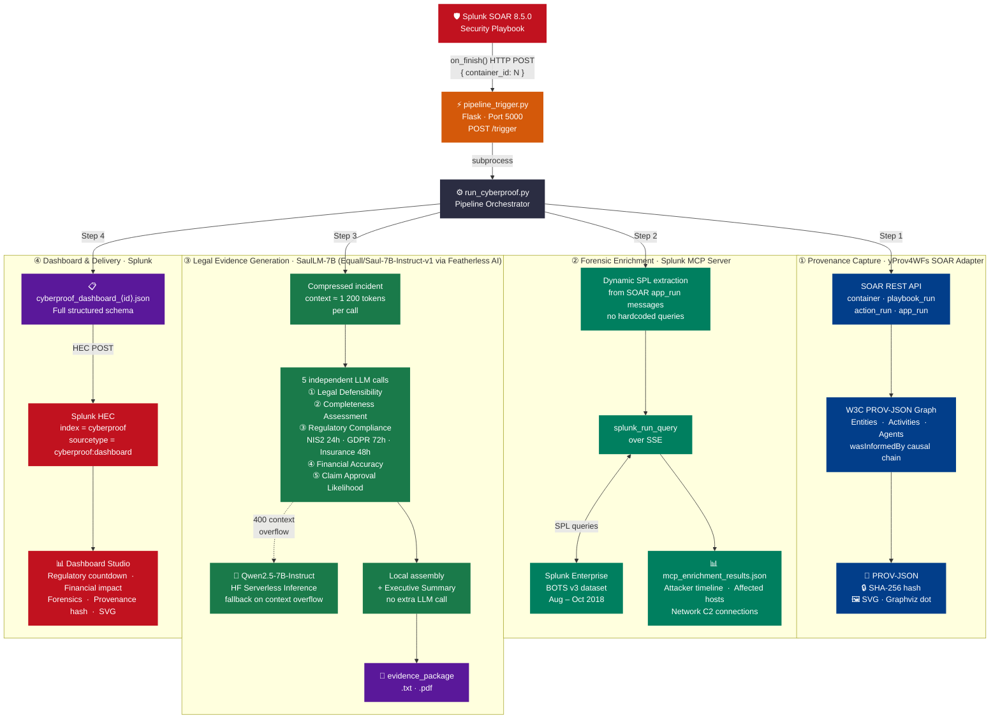

<p align="center">
  
</p>

# CyberProof

### Automated W3C PROV-Backed Cyber Insurance Evidence Generation for Splunk SOAR


---

## Problem Statement

When a cyber incident occurs, the clock starts immediately:

- **24 hours** — NIS2 Article 23 early warning to national authority
- **72 hours** — GDPR Article 33 notification to supervisory authority
- **48 hours** — Typical cyber insurance policy notification deadline

Yet producing the evidence package required to file an insurance claim is a **manual, multi-week process**. Security teams must gather logs, correlate events, draft legal-grade narrative, and calculate financial impact — all while actively responding to the incident. Worse, the resulting document has no cryptographically verifiable provenance: an auditor cannot prove *when* the evidence was collected, *what system* collected it, or whether it has been altered.

**The gap:** no standard exists for linking SOAR playbook execution to insurance-grade documentation with tamper-evident, machine-readable provenance.

---

## Solution Overview

CyberProof is a fully automated pipeline that transforms a Splunk SOAR playbook execution into a court-grade cyber insurance evidence package in minutes. A lightweight Flask webhook listener (`pipeline_trigger.py`) receives an HTTP POST from the SOAR playbook's `on_finish()` callback and fires the pipeline automatically. The pipeline captures the complete incident response workflow as a **W3C PROV-JSON provenance graph** (with SHA-256 integrity hash and SVG visualization) using the yProv4WFs library. It then queries the Splunk MCP Server to dynamically extract forensic evidence — attack timelines, affected hosts, network C2 connections — directly from the SPL queries embedded in the SOAR playbook execution logs. A legal-domain LLM (SaulLM-7B, via Featherless AI) generates each section of the insurance evidence package in a chunked pipeline that respects the model's context window. The final outputs — a structured dashboard JSON, an evidence package (`.txt` + `.pdf`), enrichment data, and the provenance graph with its SHA-256 hash and SVG — are posted to Splunk via HEC and visualized in a Splunk Dashboard Studio panel.

---

## Architecture



### Component Roles

| Component | Role |
|---|---|
| `pipeline_trigger.py` | Flask webhook listener (port 5000); receives SOAR `on_finish()` POST and spawns pipeline in a background thread |
| `run_cyberproof.py` | Top-level orchestrator; runs all 4 steps and writes 7 artifacts |
| `mcp_enrichment.py` | Authenticates to SOAR, extracts SPL queries from playbook execution logs, runs them via Splunk MCP Server |
| `generate_evidence.py` | Builds compressed incident context; calls SaulLM-7B once per evidence section; assembles final report locally |
| `evidence_config.json` | Single configuration file for financial rates, regulatory deadlines, and incident facts |
| `yProv4WFs/` | W3C PROV library with SOAR adapter; captures provenance graph from SOAR REST API |
| Splunk MCP Server | Exposes `splunk_run_query` tool over SSE; enables LLM-native forensic queries against BOTS v3 |
| SaulLM-7B | Legal-domain LLM used for structured, court-grade evidence generation |

---

## Why W3C PROV / yProv4WFs

Standard SOAR reports tell you *what* happened. Provenance tells you *how you know*.

W3C PROV is an international standard (ISO/IEC 19987) for representing the origin and history of data. A PROV-JSON graph records:

- **Entities** — the evidence artifacts produced (query results, screenshots, threat intel)
- **Activities** — the SOAR actions that produced them (IP reputation lookup, vulnerability scan, etc.)
- **Agents** — the actors responsible (SOAR platform, analyst user)
- **`wasInformedBy`** — the causal chain linking actions to each other

This creates a **machine-verifiable, tamper-evident record** of the incident response that an insurer, regulator, or court can inspect programmatically. The SHA-256 hash of the PROV-JSON graph is embedded in the dashboard and saved as a `.sha256` sidecar file, providing integrity verification.

CyberProof extends the [yProv4WFs](https://github.com/HPCI-Lab/yProv4WFs) library — which already supports Cylc and Streamflow workflow engines — with a new **SOAR adapter** that maps Splunk SOAR's `container`, `playbook_run`, `action_run`, and `app_run` REST objects to W3C PROV primitives.

---

## Key Features

- **Zero-touch auto-trigger** — Flask webhook listener receives SOAR `on_finish()` HTTP POST and fires the full pipeline automatically; includes `/health` liveness endpoint
- **Fully dynamic SPL extraction** — no hardcoded queries; SPL statements are extracted directly from SOAR `app_run` message fields, so the pipeline adapts to any playbook
- **W3C PROV causal chain** — timestamps, agents, and `wasInformedBy` relationships captured from SOAR REST API and serialized as PROV-JSON
- **SHA-256 provenance integrity** — hash of the PROV graph written to `.sha256` sidecar and embedded in the dashboard JSON under `artifacts.provenance_hash`
- **SVG provenance visualization** — PROV-JSON graph rendered to SVG via Graphviz `dot`; path included in dashboard JSON under `artifacts.provenance_svg`
- **Chunked LLM generation** — evidence package split into 5 independent SaulLM-7B calls (Legal Defensibility, Completeness, Regulatory Compliance, Financial Accuracy, Claim Approval Likelihood), each within the 4096-token context window; combined locally with no extra LLM call
- **Real-time regulatory countdown** — NIS2 (24h), GDPR Article 33 (72h), and insurance notification (48h) deadlines calculated from detection timestamp and included in dashboard JSON and evidence package
- **Financial impact calculation** — downtime cost, forensic investigation, breach notification, and NIS2 fine exposure computed automatically from configurable rates
- **Splunk Dashboard Studio** — structured JSON posted to HEC (`index=cyberproof`, `sourcetype=cyberproof:dashboard`) for real-time visualization

---

## Tech Stack

| Layer | Technology |
|---|---|
| SIEM / Data | Splunk Enterprise + BOTS v3 dataset (Aug–Oct 2018) |
| SOAR | Splunk SOAR 8.5.0 |
| MCP Interface | Splunk MCP Server (`splunk_run_query` tool over SSE) |
| Provenance | yProv4WFs library (W3C PROV-JSON, SOAR adapter) |
| Graph rendering | Graphviz `dot` (SVG output from PROV-JSON) |
| Auto-trigger | Flask 3.x (webhook listener, port 5000) |
| LLM (primary) | SaulLM-7B (`Equall/Saul-7B-Instruct-v1`) via Featherless AI / HuggingFace router |
| LLM (fallback) | Qwen2.5-7B-Instruct via HuggingFace Serverless Inference |
| Language | Python 3.11 |
| PDF generation | fpdf2 |

---

## Setup and Installation

### Prerequisites

- Python 3.11+
- Access to a Splunk Enterprise instance with the BOTS v3 dataset
- Splunk SOAR 8.5.0 instance with at least one completed playbook run
- Splunk MCP Server deployed and reachable
- HuggingFace account with access to `Equall/Saul-7B-Instruct-v1` via Featherless AI

### Configuration

Copy `.env.example` to `.env` and fill in your values:

```bash
cp .env.example .env
```

Then edit `.env` — all addresses, credentials, and tokens are read from here at runtime:

| Variable | Description | Where to get it |
|---|---|---|
| `SOAR_URL` | Splunk SOAR base URL | e.g. `https://10.x.x.x:8443` |
| `SOAR_USERNAME` | SOAR local admin username | SOAR Settings → Users |
| `SOAR_PASSWORD` | SOAR local admin password | SOAR Settings → Users |
| `SPLUNK_URL` | Splunk Enterprise management URL | e.g. `https://10.x.x.x:8089` |
| `HEC_URL` | Splunk HEC endpoint | e.g. `https://10.x.x.x:8088` |
| `SPLUNK_MCP_TOKEN` | MCP Server bearer token | Splunk Settings → Token Management |
| `HEC_TOKEN` | HTTP Event Collector token | Splunk Settings → Data Inputs → HTTP Event Collector |
| `HF_TOKEN` | HuggingFace access token | huggingface.co → Settings → Access Tokens |

The `.env` file is listed in `.gitignore` and is **never committed**. Commit `.env.example` (already in repo) as the template.

### Installation

```bash
git clone <repo-url>
cd SOAR_Adopter

# Configure environment (copy template and fill in your values)
cp .env.example .env
# Edit .env with your SOAR URL, Splunk URL, credentials, and tokens

# Install yProv4WFs library
pip install -e yProv4WFs/

# Install remaining dependencies
pip install requests python-dotenv fpdf2 huggingface-hub flask prov pydot

# Install Graphviz (for SVG provenance visualization)
# Windows:  winget install graphviz
# macOS:    brew install graphviz
# Linux:    apt install graphviz
```

### Running the Pipeline

**Option A — Manual:**
```bash
python run_cyberproof.py --container_id <SOAR_CONTAINER_ID>
```

**Option B — Auto-trigger (recommended for demo):**
```bash
# Start the webhook listener once (keep running in a terminal)
python pipeline_trigger.py

# CyberProof will fire automatically when SOAR calls on_finish():
#   POST http://<this-host>:5000/trigger  {"container_id": N}

# Liveness check:
curl http://localhost:5000/health

# Manual test trigger:
curl -X POST http://localhost:5000/trigger \
     -H "Content-Type: application/json" \
     -d '{"container_id": 9}'
```

---

## Usage and Demo

### Step 1 — Trigger a SOAR Playbook

In Splunk SOAR, run a playbook against a security incident container. CyberProof works with any playbook that includes Splunk search actions — the SPL queries are extracted automatically from the playbook execution logs.

### Step 2 — Run the Pipeline

```
python run_cyberproof.py --container_id 9
```

Expected output:
```
=======================================================
STEP 1 — Extracting provenance for container 9
=======================================================
[OK] Authenticated
[OK] Provenance saved to: prov_output/yProv4WFs_SOAR_9.json
[OK] Provenance hash: a3f7c2...
[OK] Provenance SVG:  output/yProv4WFs_SOAR_9.svg

=======================================================
STEP 2 — Enriching with Splunk MCP forensic data
=======================================================
[SOAR] Found 3 app_run(s) for container 9
[MCP] Running 3 queries extracted from SOAR playbook...
[OK] MCP enrichment complete

=======================================================
STEP 3 — Generating insurance evidence package
=======================================================
Generating insurance evidence package via SaulLM-7B — 5 sections …
  Generating section: Legal Defensibility
  Generating section: Completeness Assessment
  ...

=======================================================
STEP 4 — Building outputs
=======================================================
[OUTPUT] Dashboard:    output/cyberproof_dashboard_9.json
[OK] Dashboard posted to Splunk index=cyberproof

[OUTPUT] 4 artifacts saved to output/
```

### Step 3 — View the Dashboard

Open Splunk Dashboard Studio and load the CyberProof panel. The dashboard reads from `index=cyberproof sourcetype=cyberproof:dashboard` and displays:

- Incident timeline and attacker commands
- Regulatory deadline countdown
- Financial impact breakdown
- Provenance integrity hash
- Coverage clause assessment scores


---

## Outputs Generated

Every pipeline run produces 7 artifacts:

| File | Description |
|---|---|
| `output/yProv4WFs_SOAR_<id>.json` | W3C PROV-JSON provenance graph of the SOAR playbook execution |
| `output/yProv4WFs_SOAR_<id>.sha256` | SHA-256 integrity hash of the provenance graph |
| `output/yProv4WFs_SOAR_<id>.svg` | SVG visualization of the PROV graph (requires Graphviz) |
| `output/cyberproof_dashboard_<id>.json` | Structured JSON posted to Splunk HEC — drives Dashboard Studio |
| `output/evidence_package_<id>.txt` | Full insurance evidence package (legal narrative) |
| `output/evidence_package_<id>.pdf` | PDF version of the evidence package (requires fpdf2) |
| `output/mcp_enrichment_results_<id>.json` | Raw forensic evidence from Splunk MCP Server queries |

See [`Example/output/`](Example/output/) for sample artifacts from a real pipeline run (container 48).

The dashboard JSON schema:

```json
{
  "container_id": 9,
  "pipeline_run_at": "2026-06-14T...",
  "incident": { "detection_timestamp", "incident_type", "attacker_ip", ... },
  "response": { "playbook_run_ids", "actions", "total_response_seconds", ... },
  "forensic_summary": { "affected_hosts", "external_ips_seen", ... },
  "financial_impact_usd": { "downtime", "forensic", "breach", "total" },
  "regulatory_deadlines": { "nis2_early_warning", "gdpr_article_33", ... },
  "artifacts": {
    "provenance_standard": "W3C PROV",
    "provenance_hash": "<sha256>",
    "provenance_svg": "output/yProv4WFs_SOAR_<id>.svg",
    ...
  }
}
```

---

## Configuration

All tunable parameters live in [`evidence_config.json`](evidence_config.json):

```json
{
  "financial": {
    "downtime_rate_per_hour_usd": 15000,
    "forensic_cost_usd": 50000,
    "breach_notification_usd_per_record": 200,
    "estimated_affected_records": 10000,
    "nis2_max_fine_eur": 10000000
  },
  "deadlines_hours": {
    "nis2_notification": 24,
    "gdpr_notification": 72,
    "insurance_notification": 48
  },
  "incident": {
    "company_name": "Froth.ly",
    "incident_type": "Web Application Exploit + C2 + Backdoor Installation",
    ...
  }
}
```

No Python changes are needed to adjust financial rates, regulatory windows, or incident metadata.

---

## Roadmap

| Feature | Status |
|---|---|
| Splunk AI Assistant (SAIA) integration for NL → SPL query generation | Pending tenant provisioning |
| Cryptographic timestamping (RFC 3161) for provenance hash | Planned |
| Branching / parallel provenance for multi-path investigations | Planned |
| Local SaulLM deployment for air-gapped / data-privacy environments | Planned |
| Additional playbook types: ransomware, BEC, data exfiltration | Planned |
| MITRE ATT&CK technique annotation in provenance graph | Planned |

---